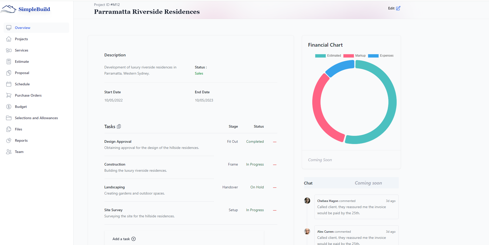
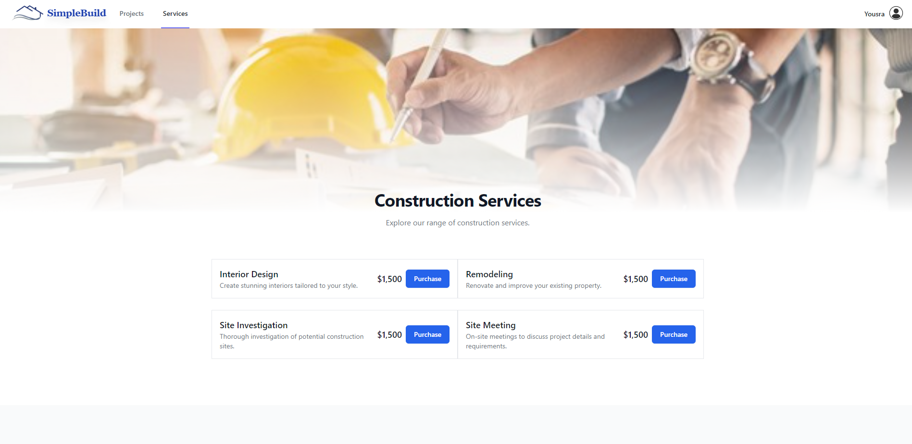

# Simple Build

## Description

Simple Build is a comprehensive software solution for streamlining the construction process.
It is to empower builders with efficient tools for planning, executing, and overseeing projects productivity.

The motivation behind this project was inspired by my husband and his brother, were they run a building business.

They are currently using multiple software to manage clients, contractors, projects and company finances, scheduling and execution.

The purpose of SimpleBuild is to create a ONE STOP solution to a address these issues.

## User Story

AS A residential builder
I WANT to manage my business effectively, and provide customer service to my clients.

## Technologies Used

- Frontend:
React.
tailwind css for styling.
Chart.js (Financial Chart).
Aceternity ui(for the 3d-card).
- Backend:
Node.js.
Express.js.
graphql.
MongoDB and the Mongoose ODM for the database.
bcrypt.

## Application Preview

The web application is hosted on Render.

View deployed application: [Simple Build](https://simple-build.onrender.com/)

## Future Development

Some of the critical features that they would need in this app:

- Client portal:
  The portal will allow the customer to login, and view the progress of their house.
  Be able to communicate with their builder, and request extra services.

- Financial feature:
  This feature will connect the builders to their accounting software (quickbooks), where they will be able to track purchase orders, incoming bills and payments.

- Some of the low priority features:
  Site diary,
  Inspection checklis,
  Subcontractors managements.

## Challenges

- Understanding the business requirements.
- Integrating the backend with the frontend.
- How to connect  stripe API to the frontend and backend.
- Deploying the app to render, where I had to learn about env variables by reading the render’s docs.

## Credits

- USYD-Bootcamp  
